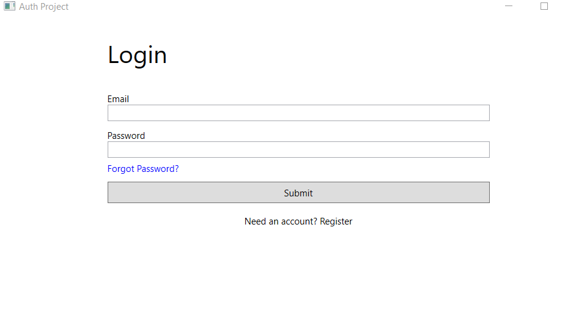
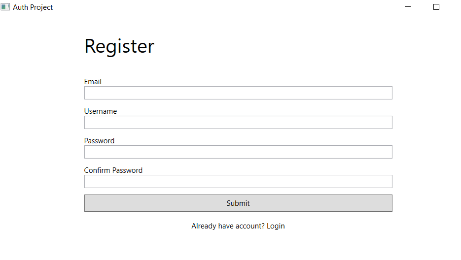
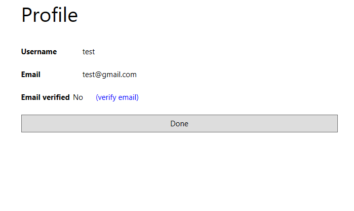
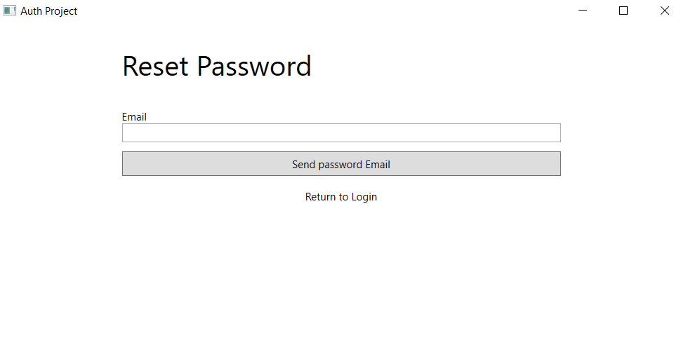
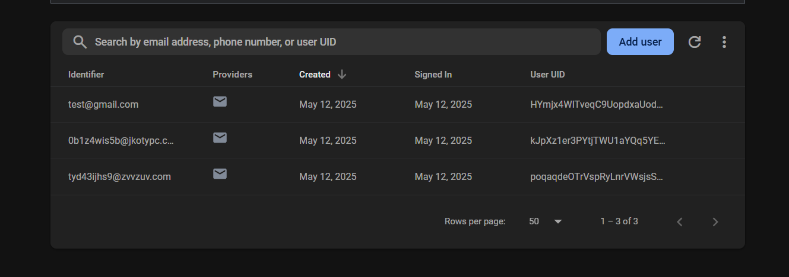

# 🔐 Auth Project

**Auth Project** — это приложение, реализующее пользовательскую аутентификацию с использованием Firebase. Проект построен на .NET.

## 📦 Состав проекта

- **Backend (ASP.NET Core API)** — простой сервер, который подключается к Firebase и предоставляет защищённый эндпоинт, доступный только авторизованным пользователям.
- **Клиент на WPF** — десктопное приложение для Windows, реализующее аутентификацию, сброс пароля и верификацию email.

## 🔧 Технологии

- .NET 9 / WPF
- ASP.NET Core Web API
- Firebase Authentication
- MVVM (WPF)

## 🚀 Как запустить

1. Настройте проект в [Firebase Console](https://console.firebase.google.com/), включите Email/Password аутентификацию.
2. Получите `FIREBASE_CONFIG` в формате JSON и добавьте его в `appsettings.json`.
3. Соберите и запустите backend (`SecretMessage.API`).
4. Запустите клиентскую часть (WPF).

## 🧪 Возможности

- Регистрация и вход через Email/Password
- Подтверждение email
- Сброс пароля
- Защищённый доступ к API

## 📸 Скриншоты

### 🖼️ Окно входа

### 🖼️ Окно регистрации

### 🖼️ Окно профиля

### 🖼️ Окно сброса пароля

### 🖼️ Список пользователей в базе Firebase

## 📸 Запись работы
[Youtube link](https://youtu.be/TFxMCUMFK5U)
